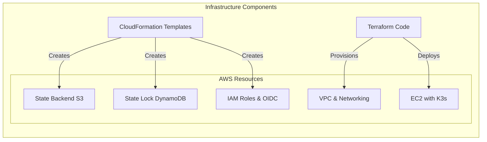
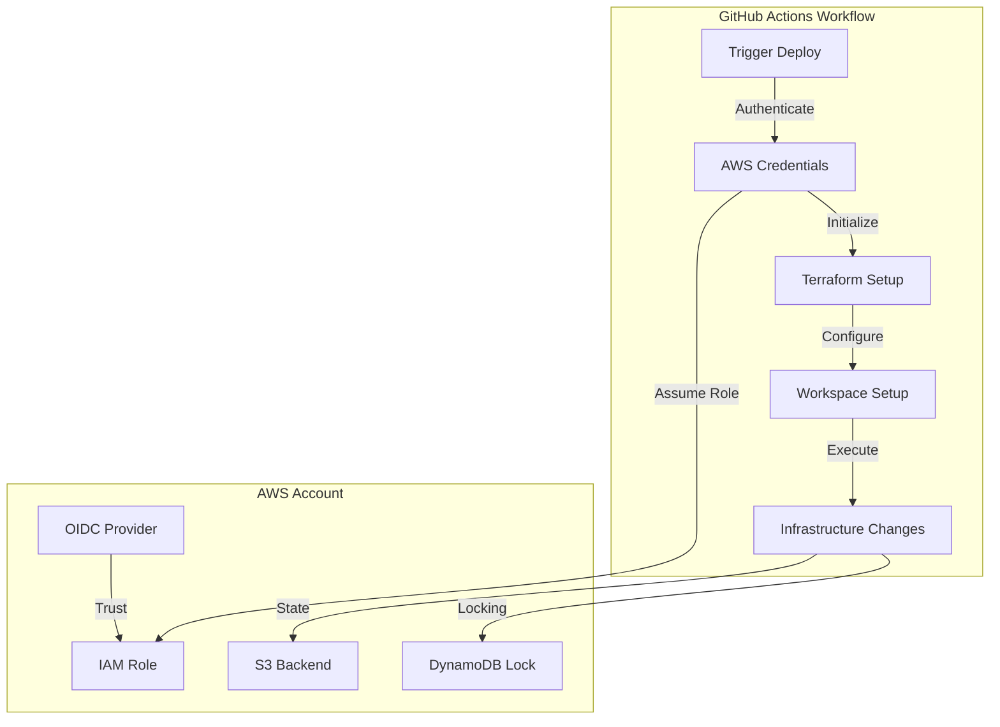
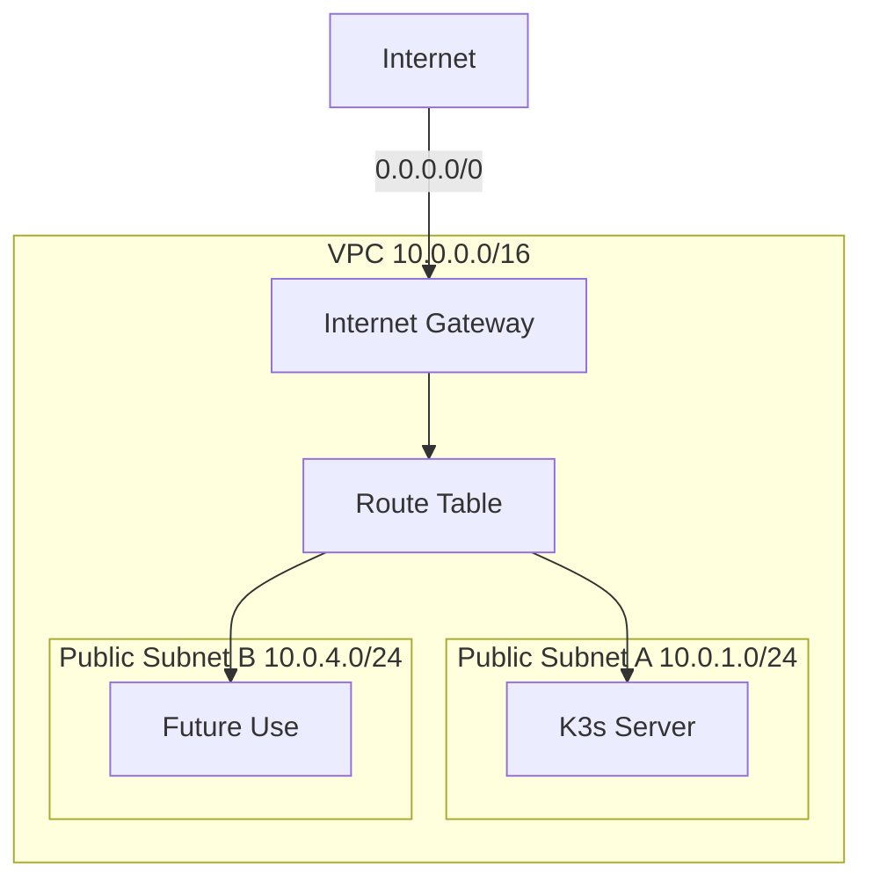
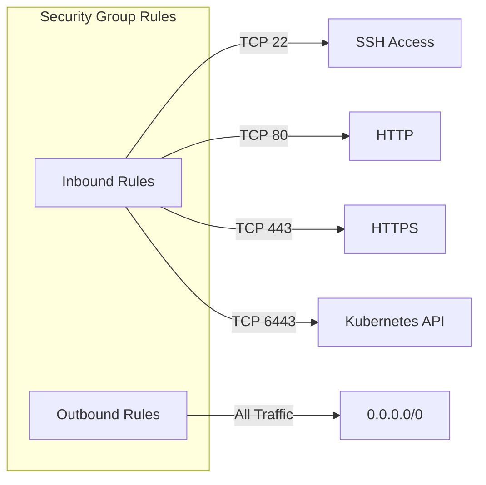
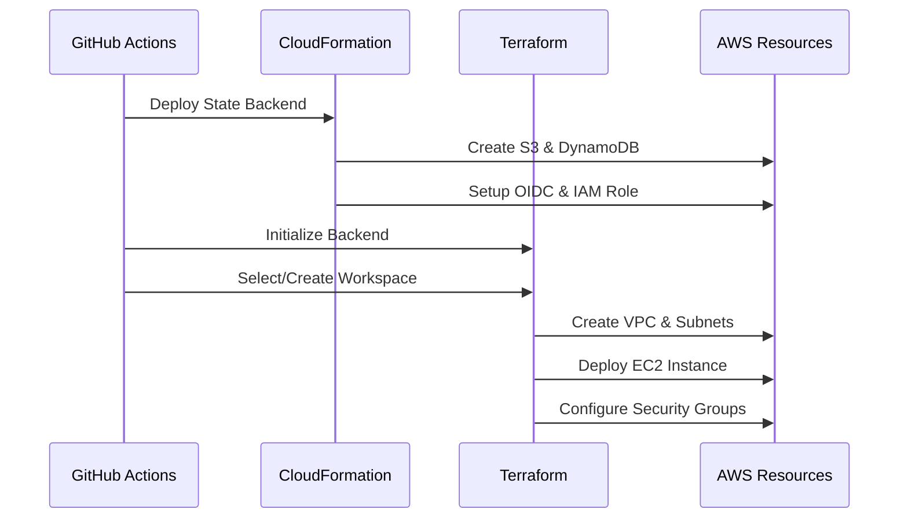

# 🏗️ Book Vault Infrastructure

This repository contains the Infrastructure as Code (IaC) for the Book Vault project, utilizing Terraform and AWS CloudFormation.

## 📋 Overview



## 🏛️ Repository Structure

```
infra/
├── .github/
│   └── workflows/
│       ├── TERRAFORM.yaml                # Workflow for managing Terraform infrastructure 
│       ├── K8S_BACKEND.yaml              # Workflow for deploying Kubernetes backend services
│       ├── K8S_INGRESS.yaml              # Workflow for setting up Kubernetes ingress resources
│       ├── K8S_LOGGING.yaml              # Workflow for deploying logging tools (e.g., Loki) on Kubernetes
│       ├── K8S_MONITORING.yaml           # Workflow for deploying monitoring tools (e.g., Grafana) on Kubernetes
│       ├── K8S_NAMESPACES.yaml           # Workflow for creating namespaces in Kubernetes
│       └── K8S_SECRET.yaml               # Workflow for creating Kubernetes secrets
│
├── aws/
│   ├── keyPair.yaml                      # CloudFormation template for SSH key pair
│   └── terraform.yaml                    # CloudFormation template for backend resources
│
├── kubernetes/
|    ├── backend/                         # Contains backend-related Kubernetes configurations.
|    │   ├── deployment.yaml              # Deployment configuration for the backend app.                      
|    │   ├── fluentd.yaml                 # ConfigMap for Fluentd logging.
|    │   └── service.yaml                 # Service configuration for backend.
|    │                                     
|    ├── ingress/                         # Contains Ingress configurations for routing.
|    │   ├── ingress_backend.yaml         # Ingress for backend service.
|    │   └── ingress_grafana.yaml         # Ingress for Grafana monitoring service.
|    │                                       
|    ├── namespaces/                      # Contains Namespace configurations for organizing resources.
|    │   ├── namespace_backend.yaml       # Namespace for backend.
|    │   ├── namespace_logging.yaml       # Namespace for logging.
|    │   └── namespace_monitoring.yaml    # Namespace for monitoring.
|    │                                      
|    └── secret/                          # Contains secret configurations.
|        ├── bookvault-tls.yaml          # TLS secret for secure backend connections.
|        └── ghcr-secret.yaml            # Docker registry secret for image pulls from GHCR.                                  
|
└── terraform/
    ├── main.tf                           # Main Terraform configuration
    ├── vpc.tf                            # vpc and networking resources
    ├── ec2.tf                            # ec2 with k3s installed
    └── variables.tf                      # Main Terraform configuration
```

## 🔄 GitOps Workflow



## 🌐 Network Architecture



## 🔒 Security Groups



## 🚀 Deployment Process



## 🏷️ Resource Naming Convention

All resources follow the naming pattern: `{environment}-{project}-{service}-{resource}`

Example:
- Environment: `main`
- Project: `bookvault`
- Service: `terraform`
- Resource: `vpc`

Final name: `main-bookvault-terraform-vpc`

## 🔐 AWS Resource Details

1. **VPC Configuration**
   - CIDR: 10.0.0.0/16
   - Public Subnet A: 10.0.1.0/24 (us-east-2a)
   - Public Subnet B: 10.0.4.0/24 (us-east-2b)
   - Internet Gateway for public access

2. **EC2 Instance**
   - Type: t2.medium
   - AMI: Ubuntu
   - K3s installation via user data
   - Public IP association enabled

3. **Security Group Rules**
   - Inbound: SSH (22), HTTP (80), HTTPS (443), Kubernetes API (6443)
   - Outbound: All traffic allowed

## 📦 State Management

CloudFormation creates and manages:
- S3 bucket for Terraform state
- DynamoDB table for state locking
- OIDC provider for GitHub Actions
- IAM roles for GitHub Actions authentication

## 📝 License

This project is licensed under the MIT License - see the [LICENSE](LICENSE) file for details.