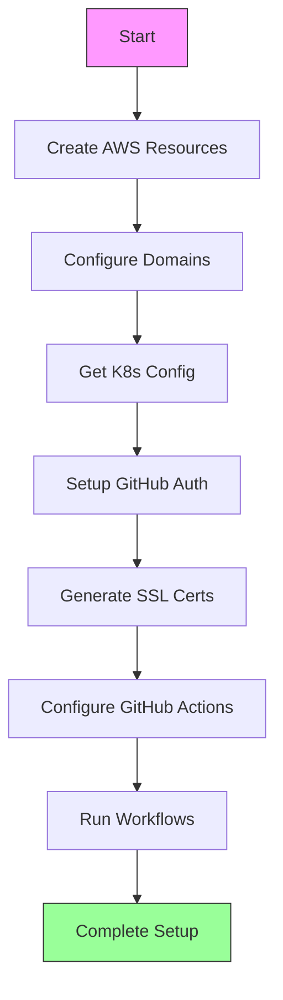
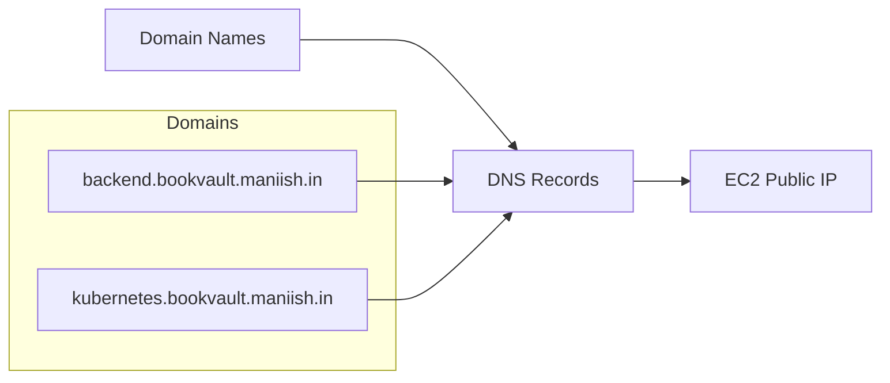
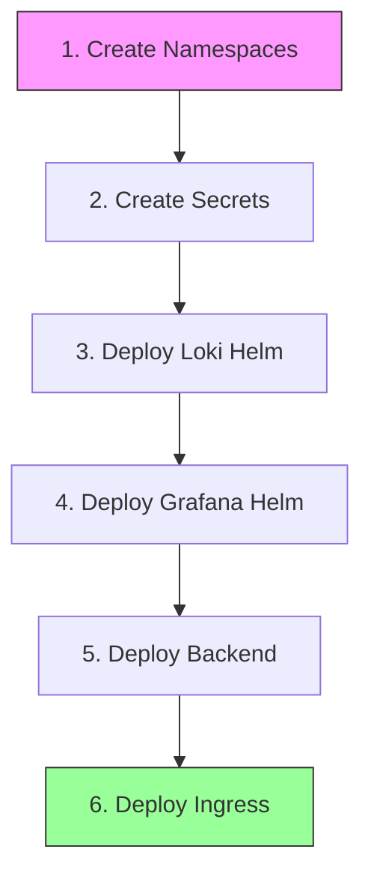

# Project Setup Guide

This guide walks through the complete setup process for the project infrastructure and deployment.

## Table of Contents
- [Prerequisites](#prerequisites)
- [Setup Flow](#setup-flow)
- [Detailed Steps](#detailed-steps)
  - [1. Resource Creation with Terraform](#1-resource-creation-with-terraform)
  - [2. Domain Configuration](#2-domain-configuration)
  - [3. Kubernetes Configuration](#3-kubernetes-configuration)
  - [4. GitHub Authentication Setup](#4-github-authentication-setup)
  - [5. SSL Certificate Generation](#5-ssl-certificate-generation)
  - [6. GitHub Actions Configuration](#6-github-actions-configuration)
  - [7. Deployment Workflows](#7-deployment-workflows)

## Prerequisites

- AWS Account with appropriate permissions
- GitHub Account with repository access
- Domain name ownership
- Terraform CLI (for manual deployment)
- SSH key pair

## Setup Flow



## Detailed Steps

### 1. Resource Creation with Terraform

#### Option A: Using GitHub Actions (Recommended)
1. Ensure the following resources are created using CloudFormation in AWS:
   - S3 Bucket
   - DynamoDB Table
   - KeyPair
   - OIDC
2. Run the "Deploy Terraform" workflow in GitHub Actions

#### Option B: Manual Terraform Deployment
```bash
terraform init
terraform plan -out=plan.tfplan
terraform apply
```

### 2. Domain Configuration

Point the following domains to your EC2 instance's public IP:
- `backend.bookvault.maniish.in`
- `kubernetes.bookvault.maniish.in`



### 3. Kubernetes Configuration

To get the K8s config file:
```bash
ssh -i <private_file> ubuntu@<public_ip>
sudo cat /etc/rancher/k3s/k3s.yaml
```

### 4. GitHub Authentication Setup

Generate Docker config authentication:
```bash
echo -n '{"auths":{"ghcr.io":{"username":"<github_username>","password":"<github_token>","email":"<github_email>","auth":"'$(echo -n "<github_username>:<github_token>" | base64)'"}}}' | base64
```

### 5. SSL Certificate Generation

1. Visit [SSLForFree](https://www.sslforfree.com/)
2. Generate certificates and obtain:
   - `certificate.crt`
   - `private.key`
3. Convert to base64:
```bash
base64 certificate.crt  # Store as BASE64_TLS_CERT
base64 private.key     # Store as BASE64_TLS_KEY
```

### 6. GitHub Actions Configuration

#### Required Secrets
| Secret Name | Description | Source |
|-------------|-------------|--------|
| KUBE_CONFIG | K8s configuration | `/etc/rancher/k3s/k3s.yaml` |
| DOCKER_CONFIG_JSON | Docker authentication | Generated in step 4 |
| BASE64_TLS_CERT | SSL certificate | Base64 encoded certificate.crt |
| BASE64_TLS_KEY | SSL private key | Base64 encoded private.key |

#### Terraform Variables
| Variable Name | Value |
|---------------|-------|
| TF_VAR_AWS_REGION | us-east-2 |
| TF_VAR_K8S_DOMAIN_NAME | kubernetes.bookvault.maniish.in |
| TF_VAR_KEYPAIR | main-bookvault-terraform-ec2-keyPair |

### 7. Deployment Workflows

Execute the following workflows in order:



1. Create Namespaces
2. Create Secrets
3. Deploy Loki Helm
4. Deploy Grafana Helm
5. Deploy Backend
6. Deploy Ingress

## Verification

After completing all steps, verify:
- All resources are created in AWS
- Domains are properly resolving
- Kubernetes clusters are accessible
- SSL certificates are valid
- All workflows completed successfully

## Troubleshooting

If you encounter issues:
1. Check AWS CloudWatch logs
2. Verify GitHub Actions workflow logs
3. Ensure all secrets and variables are properly set
4. Validate DNS propagation for domains
5. Check K8s pod status and logs

---

For additional support or questions, please open an issue in the repository.